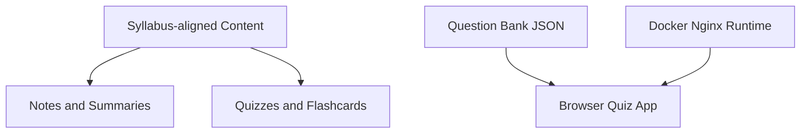

# Architecture and Tools

This repository is primarily a **content-first exam prep system** with an optional **static quiz runtime**.

## High-level architecture

## Repository structure

- `Notes/` — chapter-wise conceptual explanations.
- `QUIZ/` — chapter-wise quiz markdown files.
- `FlashCard/` — chapter-wise memory reinforcement prompts.
- `ISTQB_Sample_paper/` — sample paper materials.
- `Chapter-wise-Summary.md`, `Time-Table.md` — revision and planning aids.
- `questions.json` — structured question data consumed by the quiz frontend.
- `index.html`, `style.css`, `script.js` — static frontend implementation.
- `Dockerfile` — Nginx-based packaging for HTTP hosting.

## Runtime model (quiz app)

1. Browser loads `index.html`.
2. `script.js` loads and processes `questions.json`.
3. `style.css` applies UI styling.
4. User interacts with quiz flow in-browser.

No backend service is required for the default usage pattern.

## Tooling used in repository

- **Markdown** for educational content and documentation.
- **HTML/CSS/JavaScript** for the quiz interface.
- **JSON** for quiz data storage.
- **Docker + Nginx** for portable static hosting.

## Design intent

- Keep prep material easy to browse chapter by chapter.
- Separate data (`questions.json`) from UI (`script.js`, `index.html`).
- Preserve a low-friction setup: local browser first, container optional.
